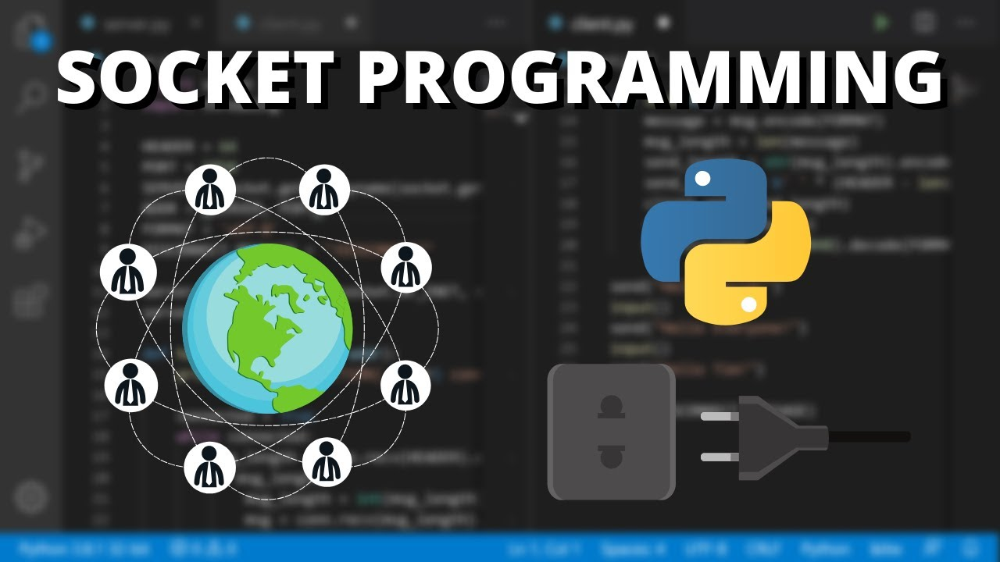

<h1 align="center">
  
</h1>

<h1 align="center">
  🔌 Game Nim - Aplicação em rede - Socket Python 🎮  
</h1>

## 💻 Sobre o projeto

- Projeto desenvolvido na matéria de Redes de Computadores I, durante o curso de Engenharia da Computação - **[@UTFPR](http://www.utfpr.edu.br/)**.

- Consiste na implementação de uma aplicação de rede utilizando sockets, focando nos tipos e ordem de mensagens e no comportamento de clientes e servidor no processo.

- Desenvolvimento de um jogo simples de dois usuários, utilizando sockets TCP, dado pelas ferramentas de confiabilidade e ordenação de segmentos.

- Implementação de um cliente e servidor, levando em conta como dois usuários jogando (um dos jogadores atuando como servidor).

## 🎮 Definição: Jogo do NIM 

Você conhece o jogo do NIM? Nesse jogo, n peças são inicialmente dispostas numa mesa ou tabuleiro. Dois jogadores jogam alternadamente, retirando pelo menos 1 e no máximo m peças cada um. Quem tirar as últimas peças possíveis ganha o jogo.

Existe uma estratégia para ganhar o jogo que é muito simples: ela consiste em deixar sempre múltiplos de (m+1) peças ao jogador oponente.

### 💡 Objetivo

Tal implementação tem por finalidade escrever um programa na linguagem Python, que permita um jogador 1 (client) jogar o NIM contra outro jogador 2 (server), considerando uma implementação em rede.

Sejam n o número de peças inicial e m o número máximo de peças que é possível retirar em uma rodada.

### :rocket: Tecnologias

This project was developed with the following technologies:

- [Python]()
- [Socket](https://docs.python.org/3/library/socket.html)

## 🔁 Fluxo de mensagens entre cliente e servidor

Você pode visualizar o fluxo de mensagens entre cliente e servidor através do link abaixo:

- [Fluxo de mensagens](.github/message_flow_client_server.pdf)


## 🚀 Como executar o projeto

   ```
   - Clone this repository:
   $ git clone https://github.com/matheusfbonfim/game_NIM_socket

   - Enter in directory:
   $ cd game_NIM_socket/src

   - First, in a terminal run the server:
   $ python3 server.py

   - In another terminal run the client:
   $ python3 client.py
   ```

## Referência

- Introdução à Ciência da Computação com Python Parte 1 - Universidade de São Paulo (USP)
- Redes de Computadores I - UTFPR

## :memo: License

O projeto está sobre a licença [MIT](./LICENSE) ❤️ 

Gostou? Deixe uma estrelinha para ajudar ⭐

<!-- Mensagem final -->
<h3 align="center">
Feito com ❤️ por <a href="https://www.linkedin.com/in/matheus-de-farias-bonfim-448667169/">Matheus Bonfim</a>
</h3>
